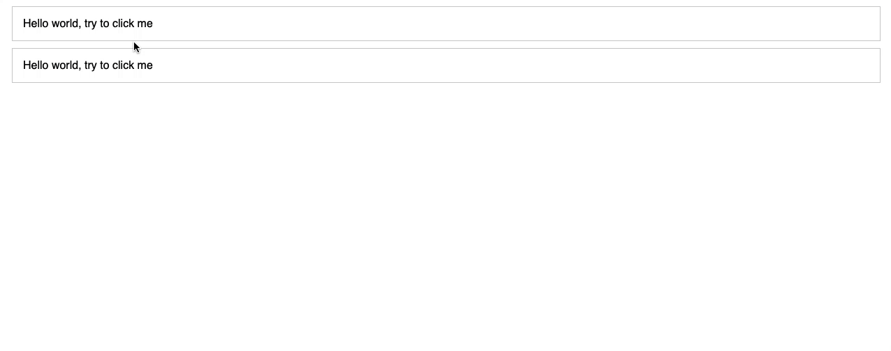

# A simple Sandbox implementation for JavaScript

## Preview



## Demo

[](https://codesandbox.io/s/quirky-microservice-8oqog?fontsize=14)

## How to use

### Install from the npm

```bash
npm install z-sandbox
# or
yarn add z-sandbox
```

### Use in your code

```javascript
import { createSandbox } from 'z-sandbox';

const sandboxOptions = {
    // default: false
    useStrict: false,
    // default: true
    useWith: true,
    // default: true
    inheritWindow: true,
    // default: []
    blacklist: ['blacklistContent']
};

const context = {
    blacklistContent: "this content is in the blacklist, you can't get it in the sandbox",
    hello: 'hello z-sandbox'
};

const sandbox = createSandbox(context, sandboxOptions);

sandbox`
    // should be undefined
    console.log(blacklistContent);
    // should be undefined
    console.log(window.blacklistContent);
    // should be undefined
    console.log(this.blacklistContent);
    // should be undefined
    console.log(self.blacklistContent);

    // should be 'hello z-sandbox'
    console.log(hello);

    window.testInject = true;
    // should be true
    console.log(window.testInject);
`;
// should be undefined, false
console.log(window.testInject, 'testInject' in window);
```
